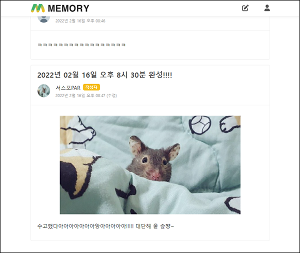
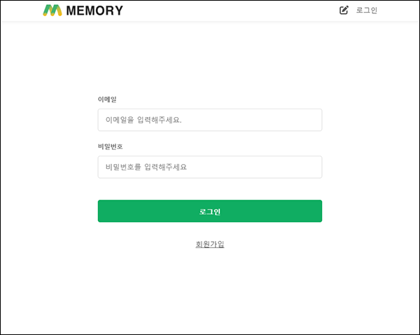

<b>[개인 프로젝트] 2022.2.07 ~ 2022.2.16</b>

<h1> Meomory - CommunityApp   https://memory-community.herokuapp.com/ </h1>

## 구현 기능 
  1. 메인화면
  2. 로그인
  3. 회원가입
  4. 글 작성
  5. 글 상세보기 (수정 + 삭제) + 덧글
  6. 마이페이지 (닉네임 수중 + 프로필 사진 수정)

 

## 활용 기술
  1. React.js
  2. styled-component
  3. React Bootstrap
  4. firebase
  5. node.js + express
  6. Mongo DB
  7. [배포] heroku

 

## 개요
- React로 진행하는 세번째번째 프로젝트입니다. 로그인 기능은 firebase, 서버는 node.js로 구축하여 배포는 heroku로 진행하였습니다.
- mongo DB에 데이터를 기록하고, 이미지같은 경우에 NAVER CLOUD PLATFORM를 통해 이미지를 가져오는 형식으로 진행하였습니다.

 

--------------------------------------------
  
   
  
## 완성된 페이지

#### 1. 메인화면

#### 2. 로그인

#### 3. 회원가입

#### 4. 글 작성

#### 5. 글 상세보기 (수정 + 삭제) + 덧글

#### 6. 마이페이지 (닉네임 수중 + 프로필 사진 수정)

